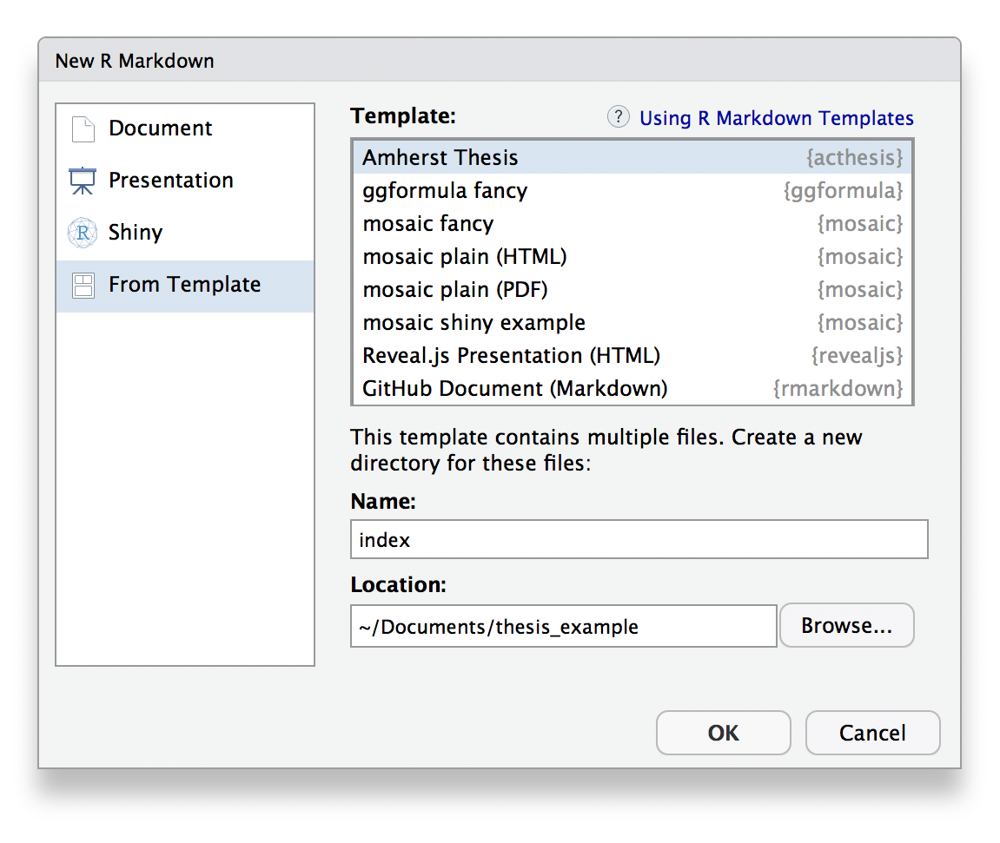

# acthesis

This project was inspired by the [bookdown](http://github.com/rstudio/bookdown) package and is an updated version of Chester Ismay's Senior Thesis template in the [`reedtemplates` package](http://github.com/ismayc/reedtemplates). 

Currently, the PDF and gitbook versions are fully-functional.  

If you are new to working with `bookdown`/`rmarkdown`, you can read over the documentation available in the [`gitbook` template](https://thesisdown.netlify.com/)  or at [Chester Ismay's site](http://ismayc.github.io/thesisdown_book).

See the [PDF Thesis Example](https://github.com/Amherst-Statistics/acthesis/blob/master/example-thesis/_book/firstName-lastName_StatThesis.pdf) and read the [acthesis user guide](https://github.com/Amherst-Statistics/acthesis/blob/master/userguide/acthesis_user-guide.pdf) for guidance.

Under the hood, the Amherst College LaTeX template is used to ensure that documents conform precisely to [submission standards](https://www.amherst.edu/academiclife/registrar/for-students/thesis_guide). At the same time, composition and formatting can be done using lightweight [markdown](http://rmarkdown.rstudio.com/authoring_basics.html) syntax, and **R** code and its output can be seamlessly included using [rmarkdown](http://rmarkdown.rstudio.com).

### Using acstats-thesis from Amherst-Statistics GitHub


Using **acthesis** has requires installing LaTeX on your computer and the `acthesis` package in R.

#### Installing LaTeX

To knit the document to PDF, you need to have LaTeX installed. We outline two options below for installing LaTeX on your machine: using the **tinytex** package in **R** (small, quick download but requires individual installation of LaTeX packages), or installing the full LaTeX download for Windows or Mac (large download: about 5 GB).

## Small LaTeX install via **tinytex**
By far the easiest way to install LaTeX on any platform is with the [**tinytex**](https://yihui.name/tinytex/) package in **R**. 

Run the following in your **R** console:
```{r, eval = FALSE}
install.packages('tinytex')
tinytex::install_tinytex()
# after restarting RStudio, confirm that you have LaTeX with 
tinytex:::is_tinytex() 
```

While required LaTeX packages *should* download automatically, you may need to install LaTeX packages or style files manually. You can do this using the `tlmgr_install` function, for example:
```{r, eval = FALSE}
# install the booktabs latex package
tinytex::tlmgr_install('booktabs')
```


## Full LaTeX install
If you have the internet connectivity, hard drive space, and know-how for managing a full LaTeX install, you can download LaTeX using one of the following:

* For any operating system: [TeX Live](https://www.tug.org/texlive/)
* For Mac: [MacTeX](http://tug.org/mactex/mactex-download.html) 
* For Windows: [MiKTeX](http://http://miktex.org/download)
    - For full download, go to the 'All downloads' tab and download the Net Installer
    - If you download the basic install instead, you may need to download individual LaTeX packages as needed (as described above)
    

#### Installing **acthesis** in RStudio

1. Ensure that you have already installed LaTeX and are using the latest version of [RStudio](http://www.rstudio.com/products/rstudio/download/).

2. Install the **remotes**, **bookdown**, and **acthesis** packages (if you are on the server, do **NOT** update any of the packages if it prompts you to. Instead, hit 'Enter' or choose the `3: None` option to avoid the package updates): 

```{r, eval = FALSE}
    if(!require("remotes")) install.packages("remotes", repos = "http://cran.rstudio.org")
    if(!require("bookdown")) install.packages("bookdown", repos = "http://cran.rstudio.org")
    remotes::install_github("Amherst-Statistics/acthesis")
```

3. Create a new R Markdown *from Template* and select *Amherst Thesis*. For now, name the primary .Rmd file `index` as shown below (you can change this later). This will create a new folder called *index* in whichever location you choose (you can rename the index folder after it is created--it has no effect on the ability to knit the thesis template). The thesis template files will be inside that folder (see figures below).

    
    
        
    

4. As a test run, knit the `index.Rmd` file to PDF to make sure everything works! [Contact Prof. Bailey](mailto:bebailey@amherst.edu) if you are having trouble. The knitted pdf and corresponding tex file will be located in the newly created index folder: `index/_book/firstName-lastName_StatThesis.pdf`. There will also be a `_bookdown_files` directory that contains any cached items and generated figures. You can delete both the `_book` and `_bookdown_files` directories after this test run. 

5. Read through the [User Guide](https://github.com/Amherst-Statistics/acthesis/blob/master/userguide/acthesis_user-guide.pdf) to see how to set up the thesis template for your use and how to work with it day-to-day


