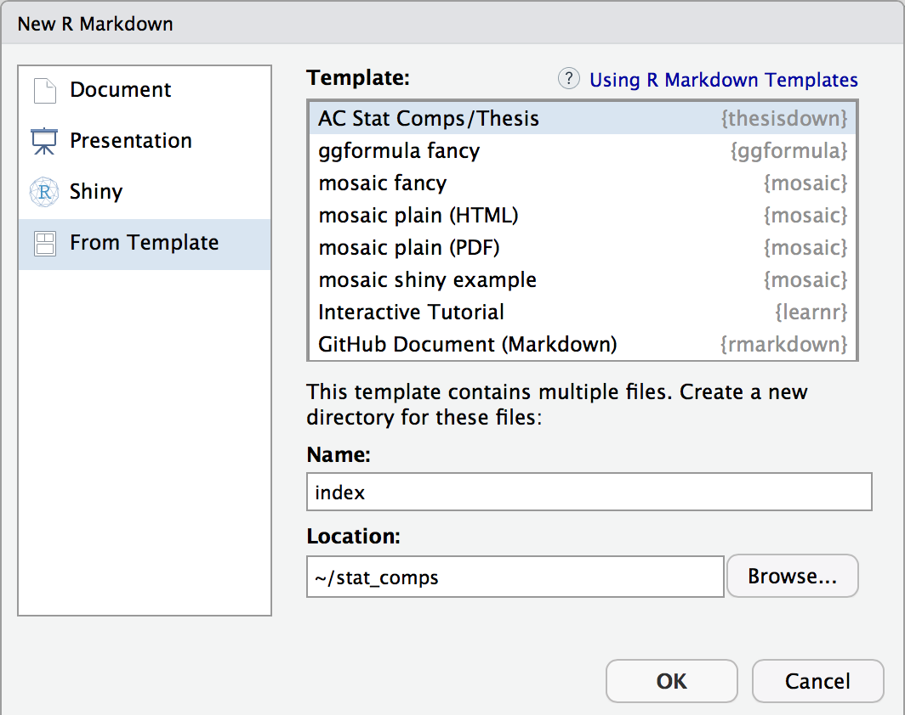

# acstats-thesis

This project was inspired by the [bookdown](http://github.com/rstudio/bookdown) package and is an updated version of Chester Ismay's Senior Thesis template in the `reedtemplates` package [here](http://github.com/ismayc/reedtemplates). 

Currently, the PDF and gitbook versions are fully-functional.  

If you are new to working with `bookdown`/`rmarkdown`, please read over the documentation available in the `gitbook` template at https://thesisdown.netlify.com/.  This is also available below at http://ismayc.github.io/thesisdown_book.

The current output for the two versions are here:
- [PDF](https://github.com/Amherst-Statistics/thesisdown/blob/master/comps_example/_book/thesis.pdf) (Generating LaTeX file is available [here](https://github.com/Amherst-Statistics/thesisdown/blob/master/comps_example/_book/thesis.tex) with other files at in the [book directory](https://github.com/Amherst-Statistics/thesisdown/comps_example/_book).)
- [gitbook](https://bebailey.github.io/comps_book/index.html)

Under the hood, the Amherst College LaTeX template is used to ensure that documents conform precisely to [submission standards](https://www.amherst.edu/academiclife/registrar/for-students/thesis_guide). At the same time, composition and formatting can be done using lightweight [markdown](http://rmarkdown.rstudio.com/authoring_basics.html) syntax, and **R** code and its output can be seamlessly included using [rmarkdown](http://rmarkdown.rstudio.com).

### Using acstats-thesis from Amherst-Statistics GitHub

Using **acstats-thesis** has some prerequisites which are described below. To compile PDF documents using **R**, you need to have LaTeX installed.  It can be downloaded for Windows at <http://http://miktex.org/download> and for Mac at <http://tug.org/mactex/mactex-download.html>.  Follow the instructions to install the necessary packages after downloading the (somewhat large) installer files.  You may need to install a few extra LaTeX packages on your first attempt to knit as well.

To use **acstats-thesis** from RStudio:

1. Install the latest [RStudio](http://www.rstudio.com/products/rstudio/download/).

2. Install the **bookdown** and **acstats-thesis** packages (if you are on the server, do **NOT** update any of the packages if it prompts you to--hit Enter or choose the `3: None` to avoid the package updates): 

```
install.packages("devtools")
install.packages("bookdown")
devtools::install_github("Amherst-Statistics/acstats-thesis")
```

3. Use the **New R Markdown** dialog to select **AC Stat Comps/Thesis** (note that this will currently only **Knit** if you name the primary .Rmd file `index` as shown below):

    
    

4. After choosing which type of output you'd like in the YAML at the top of index.Rmd, **Knit** the `index.Rmd` file to get the book in PDF or HTML formats.

5. Edit the individual chapter R Markdown files as you wish and then re-run step (4) again.
