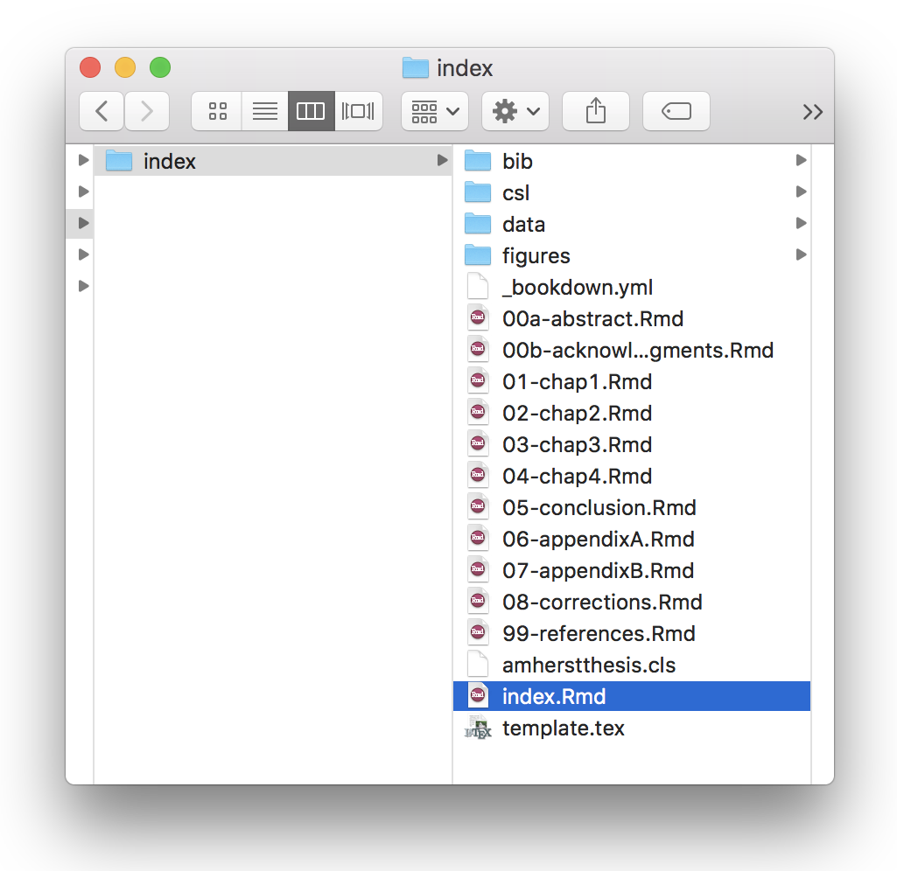
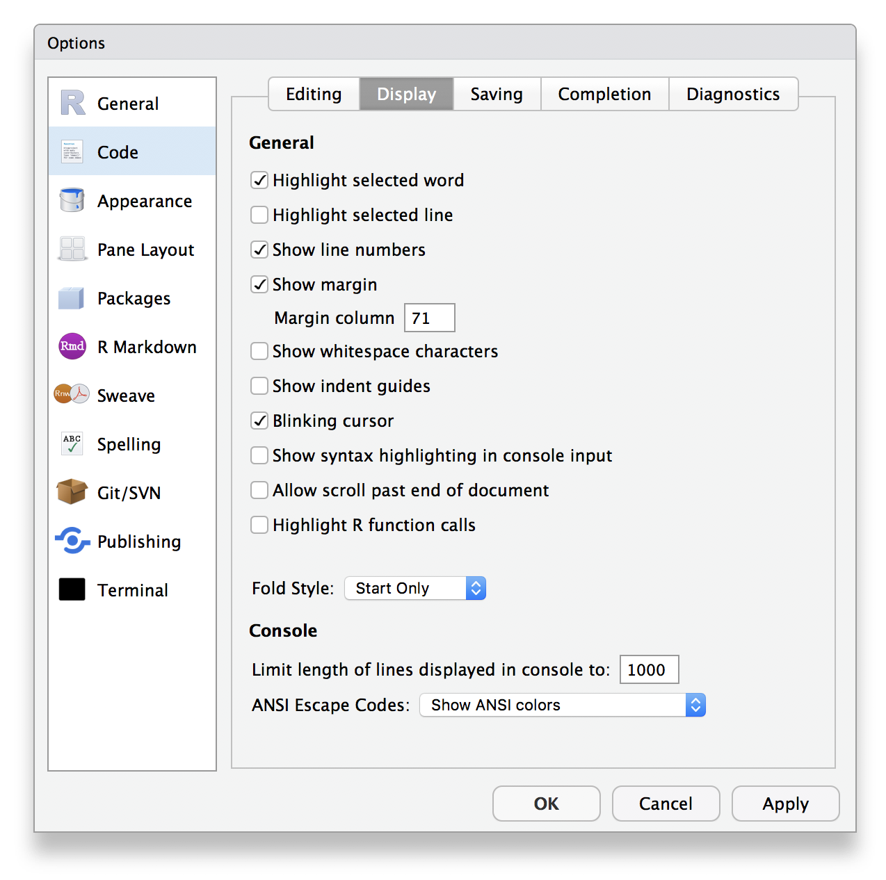
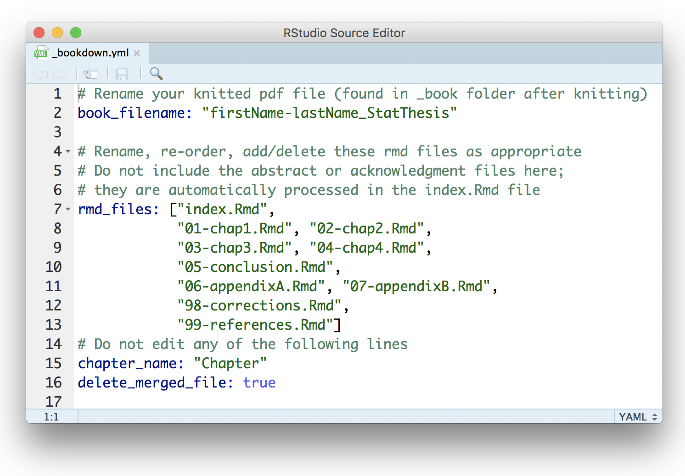

```{r, setup, include=FALSE}
require(mosaic)   # Load additional packages here 
knitr::opts_chunk$set(
  tidy=FALSE,     # display code as typed
  size="small",   # slightly smaller font for code
  fig.align = 'center'
  )
```

\newpage
# Installing LaTeX

To knit the document to PDF, you need to have LaTeX installed. We outline two options below for installing LaTeX on your machine: using the **tinytex** package in **R** (small, quick download but requires individual installation of LaTeX packages), or installing the full LaTeX download for Windows or Mac (large download: about 5 GB).

## Small LaTeX install via **tinytex**
By far the easiest way to install LaTeX on any platform is with the [**tinytex**](https://yihui.name/tinytex/) package in **R**. 

Run the following in your **R** console:
```{r, eval = FALSE}
install.packages('tinytex')
tinytex::install_tinytex()
# after restarting RStudio, confirm that you have LaTeX with 
tinytex:::is_tinytex() 
```

While required LaTeX packages *should* download automatically, you may need to install LaTeX packages or style files manually. You can do this using the tlmgr_install function, for example:
```{r, eval = FALSE}
# install the booktabs latex package
tinytex::tlmgr_install('booktabs')
```


## Full LaTeX install
If you have the internet connectivity, hard drive space, and know-how for managing a full LaTeX install, you can download LaTeX using one of the following:

* For any operating system: [TeX Live](https://www.tug.org/texlive/)
* For Mac: [MacTeX](http://tug.org/mactex/mactex-download.html) 
* For Windows: [MiKTeX](http://http://miktex.org/download)
    - For full download, go to the 'All downloads' tab and download the Net Installer
    - If you download the basic install instead, you may need to download individual LaTeX packages as needed (as described above)

\newpage
# Installing **acthesis** in RStudio

1. Ensure that you have already installed LaTeX and are using the latest version of [RStudio](http://www.rstudio.com/products/rstudio/download/).

2. Install the **remotes**, **bookdown**, and **acthesis** packages (if you are on the server, do **NOT** update any of the packages if it prompts you to. Instead, hit 'Enter' or choose the `3: None` option to avoid the package updates): 

```{r, eval = FALSE}
    if(!require("remotes")) install.packages("remotes", repos = "http://cran.rstudio.org")
    if(!require("bookdown")) install.packages("bookdown", repos = "http://cran.rstudio.org")
    remotes::install_github("Amherst-Statistics/acthesis")
```

3. Create a new R Markdown *from Template* and select *Amherst Thesis*. For now, name the primary .Rmd file `index` as shown below (you can change this later). This will create a new folder called *index* in whichever location you choose (you can rename the index folder after it is created--it has no effect on the ability to knit the thesis template). The thesis template files will be inside that folder (see figure below).

```{r template, fig.cap = "New R Markdown file from template (left) and newly created files (right)", out.width = '.49\\linewidth', echo = FALSE, fig.pos = "H",fig.show = "hold"}
knitr::include_graphics(c("figures/newtemplate.png", "figures/indexfolder.png"))
```

```{r folder, fig.cap = "Newly created index folder with thesis template files inside", out.width = '.49\\linewidth', echo = FALSE, eval = FALSE, fig.pos = "H",fig.show = "hold"}

```

4. As a test run, knit the `index.Rmd` file to PDF to make sure everything works! [Contact Prof. Bailey](mailto:bebailey@amherst.edu) if you are having trouble. The knitted pdf and corresponding tex file will be located in the newly created index folder: `index/_book/firstName-lastName_StatThesis.pdf`. There will also be a `_bookdown_files` directory that contains any cached items and generated figures. You can delete both the `_book` and `_bookdown_files` directories after this test run. 

\newpage
# Setting up the thesis template

Once you are sure the template is working (i.e., you were able to knit the index file as mentioned in Step 4 above), you can start editing the files to meet your needs! You probably want to start by renaming the index folder to something more useful (e.g., "thesis"). There are comments throughout the template files to guide you, but some information is reiterated here.

## 1. Set up RStudio "Show margin"
RStudio has a lot of options for changing the layout of the four panels and the appearance (colors, fonts) of the environment in **Preferences**. When working on your thesis, I strongly recommend adding a code margin line by going to **Preferences** --> **Code** --> **Display** tab and making sure the "Show margin" box is checked and set with a value of at most 71 (see figure below).

This will add a faint grey line to your .Rmd file while you're working to indicate where you should break R code so that it does not fall outside of the shaded box when you knit your pdf.
```{r margin, fig.cap = "Add code margin", out.width = '70%', echo = FALSE, fig.pos = "H"}

```

\newpage
## 2. Open `_bookdown.yaml` to rename and re-order `.Rmd` files {#bookdown}

The numbered `.Rmd` files ("00a-abstract.Rmd" through "99-references.Rmd") make up the text of your thesis. The `index.Rmd` file in combination with the `_bookdown.yml` file bring all of the numbered files together to create your knitted pdf. 

\Large
$\color{red}{>>>>>>>>>>>>>>>>>>>>>>>>>>>>>>>>>>>>>>>>>>>}$ 

If you rename any of the `.Rmd` files or want to include, exclude, or change the order of the files in your knitted pdf, make the corresponding changes in the `_bookdown.yml` file. 

$\color{red}{<<<<<<<<<<<<<<<<<<<<<<<<<<<<<<<<<<<<<<<<<<<}$ 

\normalsize
For example, you do not need the `98-corrections.Rmd` file (yet) so you can delete that from the list now.

```{r bookdown, fig.cap = "The \\_bookdown.yml file controls which files are knitted and in what order", out.width = '80%', echo = FALSE, fig.pos = "H"}

```

### Important notes about `_bookdown.yml`:

* `book_filename:` changes the name of the tex and pdf files knitted to the `_book` folder. 
    - **You should update this line with your name.**
* `rmd_files:` specifies which files to knit and the order in which files should be knitted 
    - the abstract and acknowledgements files should **not** be included in the list of `rmd_files`. If you rename the abstract or acknowledgment files, the filenames should be updated in the YAML heading of the index file.
    - the index file **must** be first in the list 
    - the references file **must** be last in the list

## 3. Edit the index file 

You may rename the index file (as discussed in the previous section) as long as you update the filename in `_bookdown.yml`. We will continue referring to it as the index file here.

The index file sets up the title page, abstract, acknowledgments, and table of contents. Update your YAML heading now to customize the title page and.

The index file also populates the lists of tables and figures as you make them (make sure to add labels and captions as you go). 

**No other thesis content should go in the index file.**

Make sure to update the index file if you rename any of the following files:

* abstract
* acknowledgments
* bibliography file (currently in the bib folder and name `thesis.bib`)

# Writing and formatting your thesis!

\Large

$\color{red}{>>>>>>>>>>>>>>>>>>>>>>>>>>>>>>>>>>>>>>>>>>>}$

**Reminder:** As you write and change filenames, remember to keep going back to the `_bookdown.yml` file to update filenames and knitting order, as discussed in [\color{blue}{Step 2 above}](#bookdown).

$\color{red}{<<<<<<<<<<<<<<<<<<<<<<<<<<<<<<<<<<<<<<<<<<<}$ 

\normalsize

## Chapter files

Chapter files must start with a chapter heading, e.g. `# Introduction {#intro}`.
The text in curly braces is a label for cross-referencing and will not appear in the chapter name. If you don't create a label, a default label will automatically be generated from the heading by changing the spaces to hyphens and capital letters to lowercase. 

To keep things cleaner to look at, I would recommend adding labels to each chapter heading and then only to section/subsection headings that you refer to elsewhere in the document. 


## Abstract and acknowledgements

The abstract and acknowledgements appear right after the title page. These files do not (and should not) start with a chapter heading (`#`).

These are likely the last two pieces you will write in your thesis process.

## Appendix files

The first appendix file **must** start with the following lines:

```{r eval = FALSE}
`r if(knitr:::is_latex_output()) '\\appendix'`

`r if(!knitr:::is_latex_output()) '# (APPENDIX) Appendix {-}'`
```

Every chapter title after these lines will be labeled as appendices. 

## Corrections chapter
After submitting your thesis to the department chair, any revisions to the document must be captured in a chapter called *Corrections*. This chapter should come after your last appendix file and before your references. The chapter title for your corrections should be `# Corrections {-}`. Make sure to keep the `{-}` option to leave the chapter un-numbered.

## template.tex file

The `template.tex` and `amhersthesis.cls` files largely control the formatting of the thesis document. I do not recommend editing these files with the exception of the following cases.

### Linespacing for R code or R output
While the thesis text should be double-spaced, this does not need to apply to the code and R output environments. The dispaly of R code and output are controlled (in part) by the following lines in the `template.tex` files (comments start with `%` in LaTeX):

```markdown
% set baselinestretch = 1.5 to keep code double-spaced
\DefineVerbatimEnvironment{Highlighting}{Verbatim}{
  baselinestretch = 1.5,
  commandchars=\\\{\}}

% Formatting R output display
\DefineVerbatimEnvironment{verbatim}{Verbatim}{
  baselinestretch = 1.5,
  % indent from left margin
  xleftmargin = 1.5mm,
  % vertical grey bar on left side of R output
  frame = leftline,
  framesep = 0pt,
  framerule = 1.5mm, rulecolor = \color{black!15}
  }
```

You can change the linespacing by changing the value(s) of `baselinestretch` in these sections of the `template.tex` file (on or near Line 151 and Line 156). Note that `baselinestretch = 1.5` displays the text as double-spaced. Any value larger than 1.5 makes the linespacing is ridiculously large. Any value smaller than 1 makes the lines start to overlap.


### Vertical grey bar to the left of R output
The second section of code above also controls the display of the vertical grey bar on the lefthand side of R output in the knitted pdf (on or near Lines 160 - 162). If you do not like the vertical grey bar, You may comment out the three lines that start with `frame` by placing a `%` at the start of each line. 

### amherstthesis.cls file
I do not recommend editing this file unless you are very familiar with LaTeX.


## References

The reference file must come last and must start with the line `\backmatter` to indicate the reference section.

You can rename the reference chapter, but make sure to keep the `{-}` option to leave the chapter un-numbered.

# Additional resources

## Markdown and **bookdown**

If you are new to **bookdown** (the package this  template is built on), I highly recommend bookmarking Chapter 2 of Yihui Xie's book, ["bookdown: Authoring Books and Technical Documents with R Markdown"](https://bookdown.org/yihui/bookdown/markdown-syntax.html) as a reference for **R** and LaTeX components useful to writing your thesis, including:

* _R Markdown_ syntax
* math expressions
* numbering and referencing equations
* special chunks for *theorems*, *definitions*, *proofs*, etc.
* captioning and referencing figures
* captioning and referencing tables
* in-text citations and bibliographies
* cross referencing chapters and sections
    - `Chapter \@ref{intro}` will appear as "Chapter 1" if `{#intro}` is the heading label for your Chapter 1.

## R coding style

[R coding style guide (Hadley Wickham)](http://r-pkgs.had.co.nz/style.html)


## Troubleshooting LaTeX (`tlmgr`) errors in **R**
If you are missing a file, you might get an error such as `! LaTeX Error: File 'times.sty' not found.` Then try searching for which package the file is in using `tlmgr_search`:
```{r, eval = FALSE}
# search for times.sty
tinytex::tlmgr_search('/times.sty')
```

This style file is in the `psnfss` LaTeX package, so we can then install it with `tlmgr_install`:
```{r, eval = FALSE}
# install the psnfss package
tinytex::tlmgr_install('psnfss')
```

You might eventually get an error that says `tlmgr: Remote repository newer than local`, which means you need to update (re-install) **tinytex**:
```{r, eval = FALSE}
# re-install tinytex to update
tinytex::reinstall_tinytex()
```
